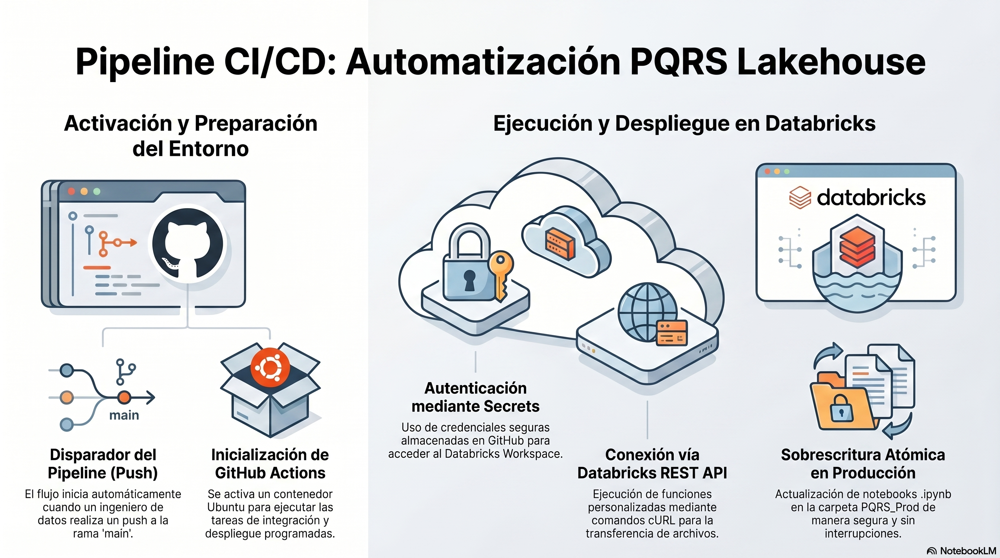

# 🌊 Data Lakehouse: Sistema Analítico y de Observabilidad PQRS 📊

**Databricks** ⚡ **PySpark** ⚡ **Delta Lake** ⚡ **GitHub Actions** ⚡ **Power BI**

*Un pipeline de datos End-to-End construido sobre la Arquitectura Medallion para la ingesta, aplanamiento de estructuras JSON complejas y modelado dimensional de miles de tickets de soporte. Diseñado para garantizar calidad transaccional (ACID) y habilitar diagnósticos de negocio y monitoreo de datos de alto rendimiento.*

---

## 📝 Descripción del Proyecto
Este proyecto implementa una solución de Ingeniería de Datos moderna de extremo a extremo (End-to-End) diseñada para procesar, limpiar y analizar miles de solicitudes, quejas y reclamos (PQRS) del departamento de servicio al cliente. 

El sistema ingesta datos estructurados y semi-estructurados (JSON), evalúa texto mediante expresiones regulares (Regex) para determinar la criticidad de los tickets, y consolida Datamarts analíticos para el consumo del equipo de Data Analytics a través de Power BI.

## 🏗️ Arquitectura de la Solución (Medallion Architecture)

El pipeline de datos está diseñado bajo el patrón **Medallion Architecture** sobre Delta Lake, garantizando escalabilidad, calidad de datos transaccional (ACID) y características de Time Travel.

1. **🥉 Capa Bronze (Raw Data):** - Ingesta de datos crudos desde sistemas fuentes (Azure SQL / APIs).
   - Almacenamiento del estado inmutable e histórico (Archivos JSON/CSV).
2. **🥈 Capa Silver (Clean & Conformed Data):** - Transformaciones en PySpark.
   - Limpieza de datos (Drop nulls, Trim, Cast de variables).
   - Aplanamiento de estructuras complejas (Flattening de `detalles_tecnicos`).
   - Cruces de información de agentes y tickets (Left Joins).
   - Creación de métricas calculadas mediante Regex (Clasificación de Criticidad).
3. **🥇 Capa Gold (Aggregated Data & Datamarts):** - Creación de Modelos Estrella para KPIs de negocio.
   - Tablas optimizadas para conectividad con Power BI (`kpi_agentes`, `kpi_tecnologia`, `kpi_tendencias`).

## 🎯 Productos de Datos Generados

El Lakehouse está diseñado para servir a dos audiencias clave utilizando las herramientas más adecuadas para cada contexto:

### 1. Tablero de Data Observability (Para Ingeniería de Datos)
*Construido de forma nativa en **Databricks Dashboards**.*
Diseñado para monitorear la salud del pipeline y la calidad de los datos inyectados:
* **Monitoreo de Ingesta:** Detección de caídas de volumetría (Drop de datos).
* **Salud de APIs:** Tracking del volumen de tickets segmentado por origen para detectar fallos en endpoints.
* **Data Freshness (Frescura):** Validación del último timestamp procesado para garantizar la ejecución del Orquestador.
* **Radar de Anomalías:** Detección de outliers en tiempos de procesamiento (Alertas sobre fallos de casteo o zonas horarias).

### 2. Dashboard Analítico y Operativo (Para Data Analytics y Negocio)
*Construido en **Power BI** conectado vía Databricks JDBC/ODBC.*
Diseñado bajo principios de Data Storytelling para diagnóstico operativo:
* **Rendimiento de Agentes:** Gráficos de dispersión para cruzar carga de trabajo vs. tiempos de atención.
* **Diagnóstico Tecnológico:** Detección de cuellos de botella y fallos críticos segmentados por Sistemas Operativos (iOS, Android, Windows).
* **Tendencias Temporales:** Análisis de picos de estrés durante el día para optimizar la malla de turnos del Contact Center.

## 🛠️ Stack Tecnológico
* **Orquestación y Cómputo:** Databricks Workflows / Clusters
* **Procesamiento de Datos:** Apache Spark (PySpark)
* **Almacenamiento:** Delta Lake (Formato Parquet optimizado)
* **CI/CD (Despliegue Continuo):** GitHub Actions
* **Consumo Visual:** Power BI Desktop & Databricks Genie / SQL Dashboards

## 🔄 Flujo de Integración y Despliegue Continuo (CI/CD)

Este repositorio cuenta con un pipeline automatizado en `deploy.yml`. Cada vez que un Data Engineer realiza un `push` a la rama `main`:
1. GitHub Actions inicializa un contenedor Ubuntu.
2. Utiliza credenciales seguras (Secrets) para autenticarse en el Databricks Workspace.
3. Ejecuta una función personalizada basada en Databricks REST API (usando cURL).
4. Sobrescribe de manera atómica los notebooks `.ipynb` en la carpeta de Producción (`PQRS_Prod`).

## 🚀 Cómo ejecutar este proyecto localmente
1. Clona el repositorio: `git clone https://github.com/tu-usuario/pqrs-data-lakehouse.git`
2. Configura los secretos en tu repositorio (`DATABRICKS_HOST`, `DATABRICKS_TOKEN`).
3. Ejecuta los notebooks en orden numérico:
   - `00_preparacion_ambiente.ipynb` (DCL y DDL de base de datos).
   - `01_extract.ipynb` (Ingesta a Bronze).
   - `02_transform.ipynb` (Limpieza a Silver).
   - `03_load.ipynb` (Agregaciones a Gold).

## 💡 Manejo de Errores y Calidad de Datos Implementados
* **Auto-Optimize / Concurrent Writes:** Prevención de colisiones de transacciones Delta mediante esperas explícitas para tareas asíncronas.
* **Regex Case-Insensitive:** Extracción tolerante a fallos gramaticales en la caja de comentarios del usuario final (ej. `(?i)pésimo|robo|cierra sola`).
* **Dynamic Renaming:** Tolerancia al esquema de origen (Case-Insensitivity en columnas de bases de datos relacionales).

---
*Desarrollado con ❤️ por el Equipo de Data Engineering - Alvaro Jose Muñoz Murillo.*
